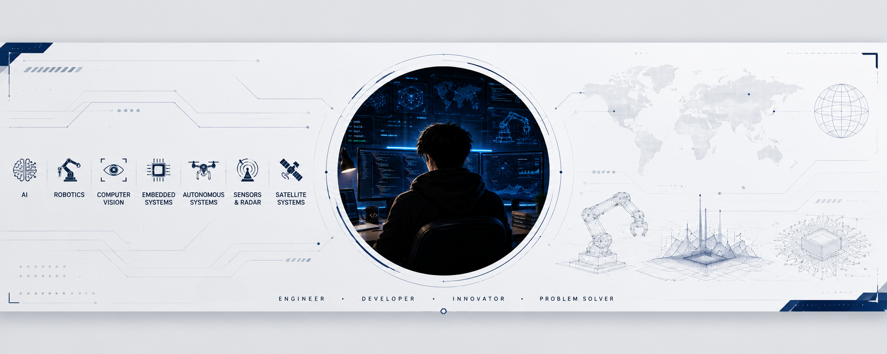
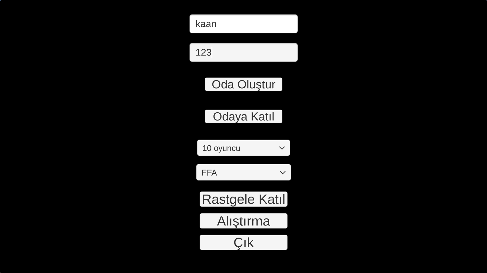
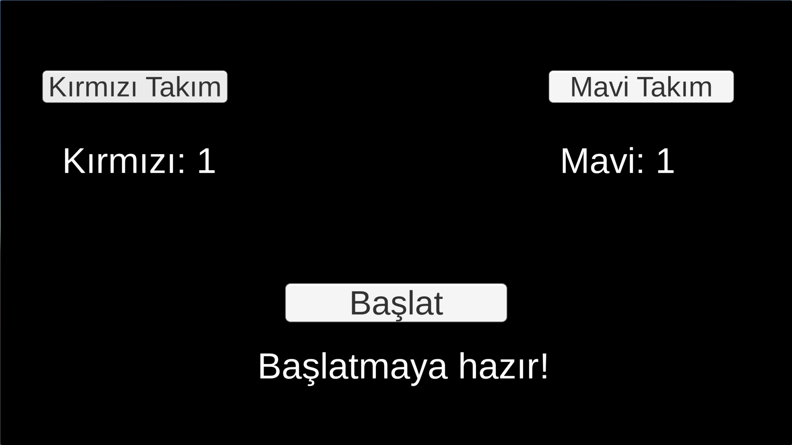
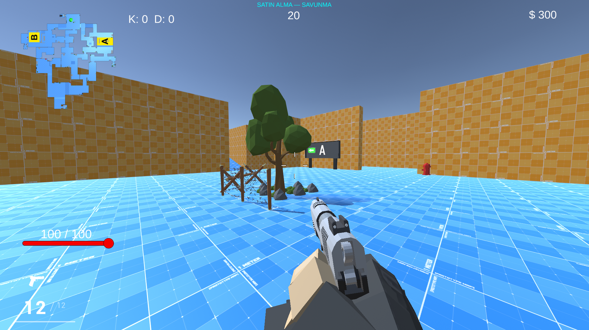
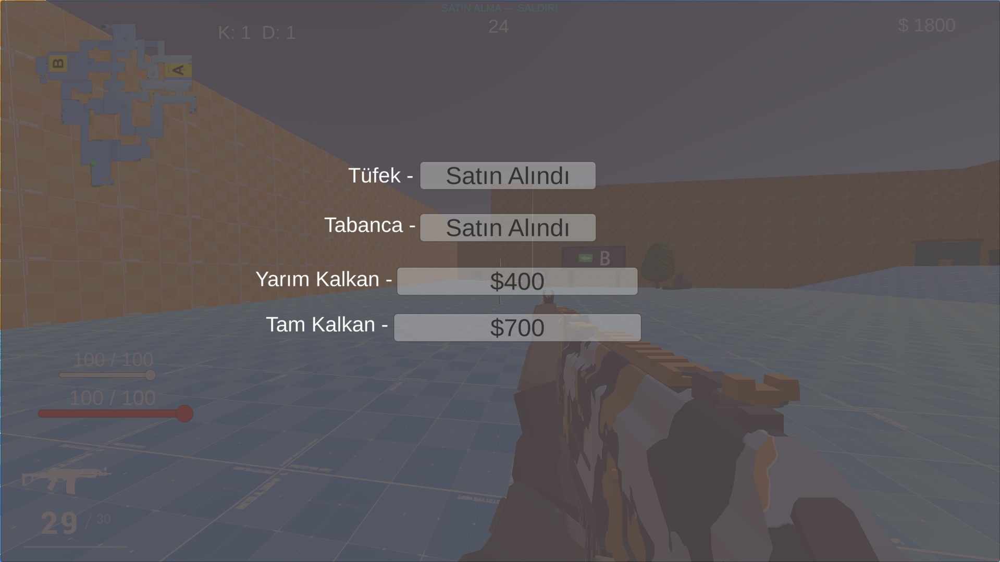
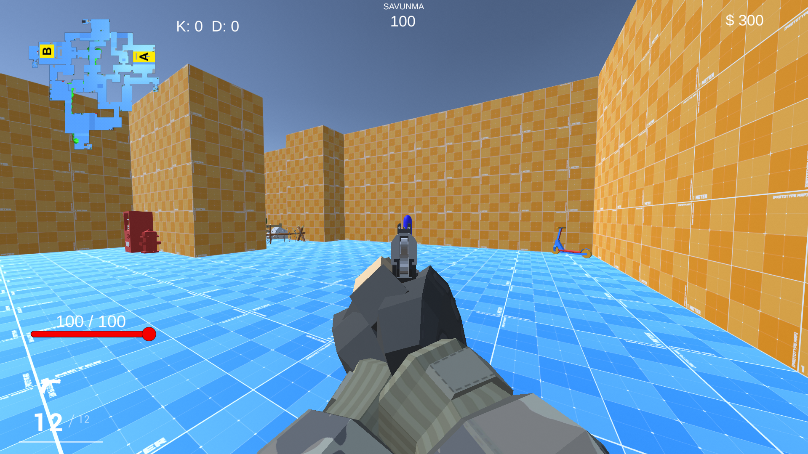
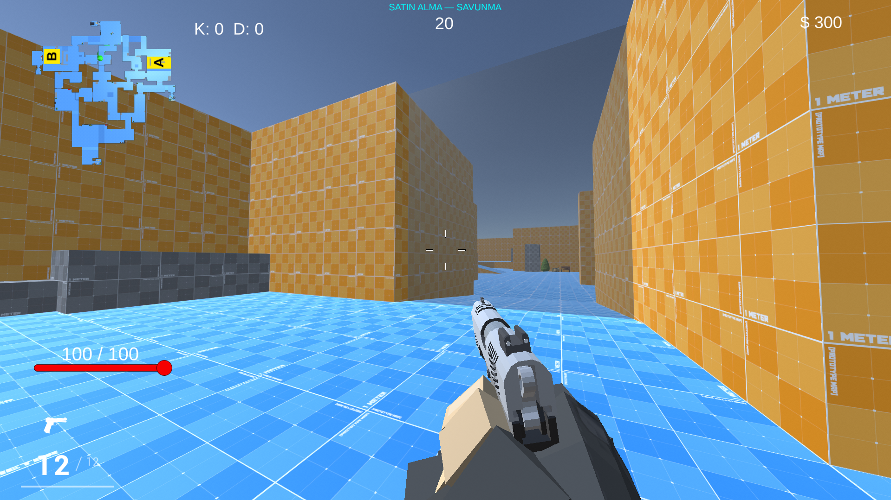
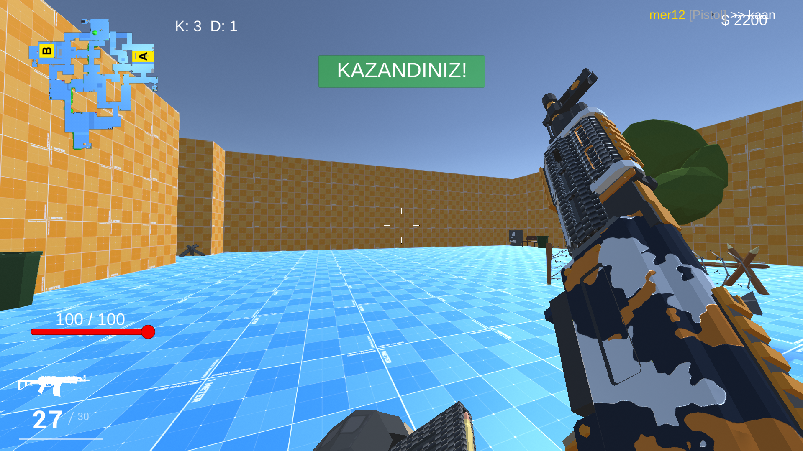

<p align="center">
  
</p>

<h1 align="center">🎯 unity_multiplayer</h1>

<p align="center">
  <b>Round-based multiplayer FPS built with Unity and Photon PUN 2</b><br>
  Lobby &amp; rooms · Red vs Blue teams · Buy phase economy · A/B bomb sites
</p>

<p align="center">
  
  
  
  
  
</p>

> **Status:** 🚧 In development. Third-party assets are **not** included in this repository, see [Required third-party packages](#-required-third-party-packages).

---

## 📸 Screenshots

<table>
  <tr>
    <td width="50%"><br><sub><b>Lobby</b>: create / join a room, random join, practice range</sub></td>
    <td width="50%"><br><sub><b>Team select</b>: Red vs Blue with live team counts</sub></td>
  </tr>
  <tr>
    <td width="50%"><br><sub><b>Buy phase</b> (defense): timer, K/D, money, minimap with A/B sites</sub></td>
    <td width="50%"><br><sub><b>Shop</b>: rifle, pistol, half and full shield</sub></td>
  </tr>
  <tr>
    <td width="50%"><br><sub><b>Live round</b>: round timer, health, ammo, minimap</sub></td>
    <td width="50%"><br><sub><b>Map</b>: corridors, cover and bomb site signs</sub></td>
  </tr>
</table>

### 🏆 Win screen and kill feed

<p align="center">
  
</p>

---

## 🚀 Features

- 🏠 **Lobby and rooms**: enter a player name, create a room or join one, random join and room size (2 to 10 players). The lobby lists FFA and Team Deathmatch, but they are placeholders: the bomb attack/defense mode is the only implemented game mode
- 🔴🔵 **Team select**: pick Red or Blue team, live player count per team, host starts the match
- 💰 **Round economy**: buy phase before each round, money shown on the HUD
- 🛒 **Shop menu**: rifle, pistol, half shield ($400) and full shield ($700)
- 💣 **Attack / defense rounds** with **A and B bomb sites**: attackers plant the bomb, defenders defuse it
- 🗺️ **Minimap** with site markers and player icons
- 📟 **HUD**: health bar, ammo counter, weapon icon, K/D, money, round timer and phase label
- ☠️ **Kill feed** and **win banner**
- 🎯 **Practice range** (`Alıştırma`) with targets and enemies, separate from online matches

## 📥 Download

Want to just play? Grab the latest Windows build from the **[Releases page](https://github.com/kaandevs-ops/unity_multiplayer/releases/latest)**.

1. Download the `.zip` file from the latest release.
2. Extract it to any folder.
3. Run the `.exe` file.

> Online matches need every player on the same version. To run the project from source instead, see [Setup](#%EF%B8%8F-setup).

## 🕹️ Game Flow

1. **Lobby**: enter your name and a room name, then create or join a room (or use random join).
2. **Team select**: choose Red or Blue. The host presses **Başlat** when ready.
3. **Buy phase**: a 30-second countdown (default) where you spend money in the shop.
4. **Round**: attackers plant the bomb at site A or B and defenders defuse it. If no bomb is planted, the fight phase lasts 120 seconds by default. A 5-second round end follows.
5. **Result**: kills, deaths and money update, and the winner is announced.

## 🏗️ Tech Stack

| Category | Technology |
| --- | --- |
| Engine | Unity 6000.3.8f1 |
| Language | C# |
| Networking | Photon PUN 2 |
| Input | Unity Input System |
| UI | Unity UI, TextMeshPro |
| Player / weapons | Low Poly Shooter Pack (Infima Games), third-party |
| Map | Prototype Map, third-party |

## 📁 Project Structure

Only the project's own code, scenes and settings are tracked in this repository:

```
unity_multiplayer/
├── Assets/
│   ├── Scenes/
│   │   ├── LobbyScene.unity     # Lobby, rooms, team select
│   │   └── Range.unity          # Practice range
│   ├── Scripts/
│   │   ├── NetworkManager.cs        # Photon connection and room handling
│   │   ├── LobbyManager.cs          # Lobby UI and room list
│   │   ├── PlayerSpawner.cs         # Player spawning
│   │   ├── NetworkCharacterSetup.cs # Per-player network setup
│   │   ├── WeaponShoot.cs           # Shooting
│   │   ├── PlayerHealth.cs          # Health and damage
│   │   ├── RoundManager.cs          # Round and phase flow
│   │   ├── ShopManager.cs           # Buy menu and economy
│   │   ├── ScoreManager.cs          # K/D and scoreboard
│   │   ├── BombSystem.cs            # Bomb logic
│   │   ├── BombSiteTrigger.cs       # A/B site triggers
│   │   ├── Hudmanager.cs            # HUD
│   │   ├── Minimapicon.cs           # Minimap player icons
│   │   ├── Minimapsiteicon.cs       # Minimap site icons
│   │   └── Rangesetup.cs            # Practice range setup
│   ├── Sibgle/                  # Practice range targets and enemies
│   ├── Resources/               # Kill feed, room row and score row prefabs
│   ├── AngeloMaN87/             # Minimap prefab, render texture, materials
│   └── InputSystem_Actions.inputactions
├── Packages/                    # Unity package manifest
├── ProjectSettings/
├── LICENSE
└── README.md
```

## 📦 Required third-party packages

Third-party packages are **not** included because of their licenses. Download them separately and import them into `Assets/` before opening the project:

| Package | Source |
| --- | --- |
| Photon PUN 2 (PUN 2 - FREE) | Unity Asset Store (Photon Engine) |
| Low Poly Shooter Pack - Free Sample | Unity Asset Store (Infima Games) |
| Prototype Map | Unity Asset Store (AngeloMaN87) |
| Low Poly Pack - Environment Lite | Unity Asset Store (Solum Night) |
| Low Poly Barriers Pack Free | Unity Asset Store (Schatro Dev Assets) |
| Low-Poly Urban Assets | Unity Asset Store (AIRIDEV) |

## ⚙️ Setup

1. Clone the repository and open it with **Unity 6000.3.8f1** (Unity Hub).
2. Import the packages listed above into `Assets/`.
3. Create your own Photon app on the Photon dashboard and paste its **AppId** into the PUN settings (`Window → Photon Unity Networking → Highlight Server Settings`). The AppId is not stored in this repository.
4. The player prefab `Assets/Resources/P_LPSP_FP_CH.prefab` is derived from the Infima package and is not included. Recreate it from the package.
5. Open `Assets/Scenes/LobbyScene.unity` and press Play.

### Notes

- The project does **not compile** until Photon and the Infima package are imported.
- Scenes show missing references until the packages are imported.
- Build Settings lists the Prototype Map scene, which comes from the Prototype Map package. When the host presses **Başlat**, the game loads the scene named `Prototype Map`, so that scene must stay in Build Settings under that exact name.

## 📄 License

Copyright 2026 kaandevs-ops

The code, scenes and settings in this repository are licensed under the **Apache License 2.0**, see [LICENSE](LICENSE). Third-party packages are subject to their own licenses and are not covered by it.

---

<p align="center"><i>Still learning, still shipping.</i></p>

<p align="center">
  <a href="https://github.com/kaandevs-ops">
    
  </a>
</p>


